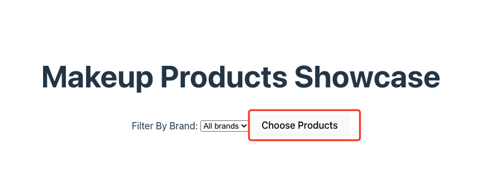

The first version :
I found that the page has to upload almost 1000 products, some image can't show on the page, due to uploading problems;

The second version:
I updated it wether i can choose cosmetics according to different brand.

There ara some problems:

Main Page：choose products button does not work! and can not choose brands!
The lists of cosmetics have almost the same page than main page! how to fix it!

I did not use css cause i can not install tailwindCSS in my computer, i stuck in "npx tailwindcss init -p";
